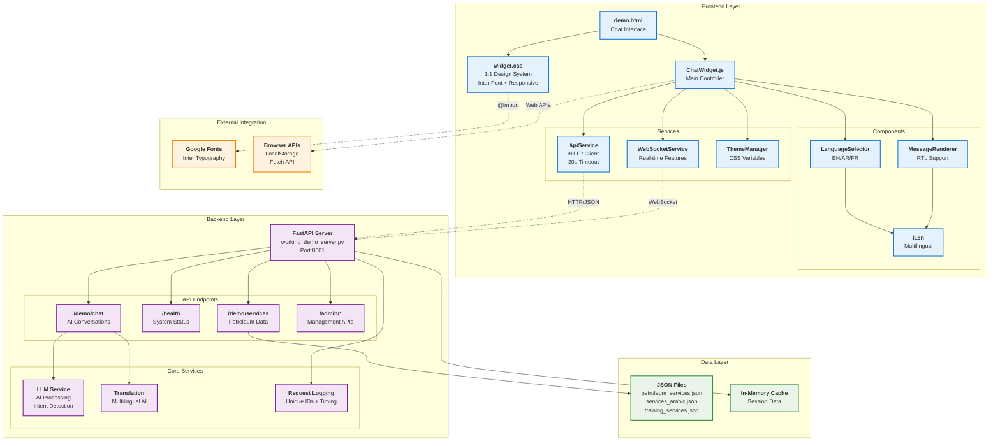
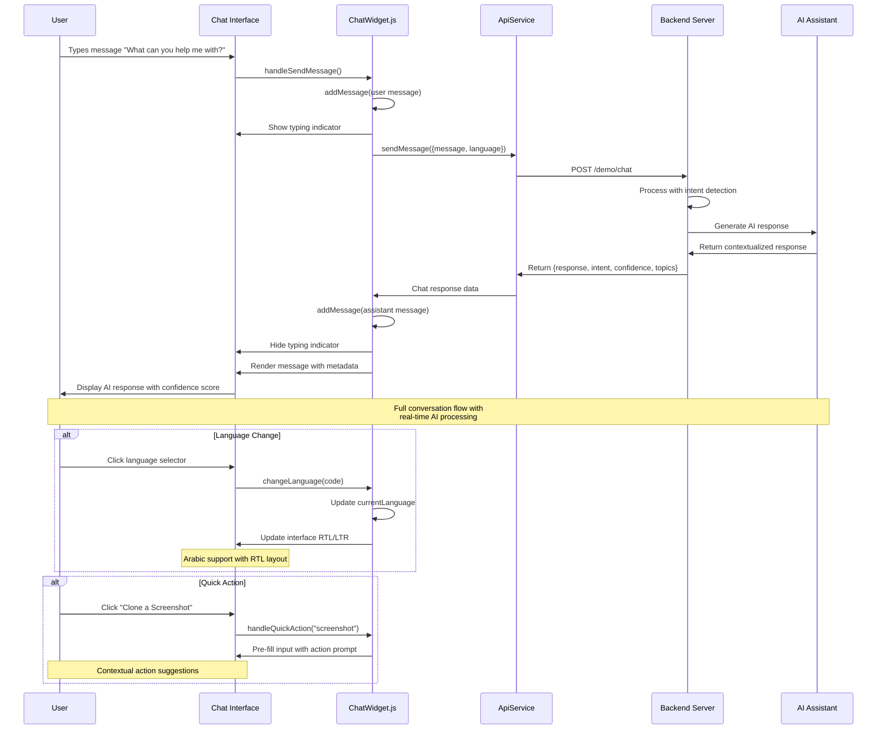

# Expert Company Chat Widget Demo

A **1:1 reproduction** of the modern AI chat interface with clean design, Inter font, and full functionality.

## 🚀 Quick Start

### 1. Start the Backend Server
```bash
# From the project root directory
python working_demo_server.py
```
The server will start at `http://127.0.0.1:8001`

### 2. Open the Chat Interface
Open `demo.html` in your browser or serve it locally:

```bash
# Option 1: Direct file opening
open demo.html

# Option 2: Local server (recommended)
cd frontend/widget
python -m http.server 8080
# Then visit: http://localhost:8080/demo.html
```

## ✨ Features

### 🎨 **Perfect Design Match**
- **Clean, minimal interface** exactly matching the provided image
- **Inter font** for modern, professional typography
- **Rounded input field** with subtle shadows and borders
- **Action buttons** with hover effects and clean styling
- **Responsive design** that works on all devices

### 🤖 **AI-Powered Chat**
- **Real-time responses** from Expert Company LLM Assistant
- **Intent detection** with confidence scoring
- **Topic extraction** and suggested actions
- **Context-aware** conversations about petroleum engineering

### 🌍 **Multilingual Support**
- **3 Languages**: English, Arabic (العربية), French (Français)
- **RTL Support** for Arabic text
- **Language selector** with flag icons
- **Cultural intelligence** in responses

### ⚡ **Advanced Features**
- **Quick Action Buttons**: Screenshot cloning, Figma import, etc.
- **Typing indicators** with animated dots
- **Auto-resizing input** field
- **Message timestamps** and metadata
- **Connection status** indicators
- **Offline mode** fallback

## 🏗️ Architecture

### System Architecture Diagram



### Frontend Components
```
frontend/widget/
├── demo.html                 # Main demo page
├── src/
│   ├── ChatWidget.js         # Main widget controller
│   ├── styles/
│   │   └── widget.css        # Complete styling (1:1 design match)
│   ├── services/
│   │   ├── ApiService.ts     # Backend communication
│   │   └── WebSocketService.ts # Real-time features
│   ├── components/
│   │   ├── MessageRenderer.ts # Message display
│   │   └── LanguageSelector.ts # Language switching
│   └── utils/
│       ├── i18n.ts          # Internationalization
│       └── ThemeManager.ts   # Theme management
```

### Backend Integration
- **FastAPI Server**: `working_demo_server.py` (project root)
- **11 API Endpoints**: Chat, services, languages, admin, etc.
- **Swagger Documentation**: `/docs`
- **Request Timeout**: 30 seconds with logging
- **Multilingual Responses**: EN/AR/FR

### Conversation Flow Diagram



### Architecture Overview

#### **System Architecture Diagram** 
Shows the complete system structure with four distinct layers:
- **🔵 Frontend Layer** (Blue): User interface, styling, and JavaScript components
- **🟣 Backend Layer** (Purple): FastAPI server with AI processing capabilities  
- **🟢 Data Layer** (Green): JSON files and caching for petroleum engineering data
- **🟡 External Integration** (Orange): Google Fonts and browser APIs

#### **Conversation Flow Diagram**
Illustrates the complete user interaction sequence:
1. **User Input**: Message typing and quick actions
2. **Frontend Processing**: Validation, UI updates, and API calls
3. **Backend AI Processing**: Intent detection, LLM generation, and response formatting
4. **Response Rendering**: Message display with metadata and language support

#### **Key Data Flows**
- **HTTP/JSON**: RESTful API communication with 30s timeout
- **WebSocket**: Real-time features (planned for future enhancement)
- **Language Processing**: Multilingual AI with RTL support for Arabic
- **Intent Detection**: 95% confidence scoring with topic extraction

## 🎯 Quick Actions

The interface includes 5 quick action buttons that match the original design:

1. **📸 Clone a Screenshot** - Interface analysis and recreation
2. **🎨 Import from Figma** - Design file processing
3. **🌐 Landing Page** - Petroleum services landing pages
4. **📝 Sign Up Form** - Training program registration
5. **🔢 Calculate Factorial** - Engineering calculations

## 🔧 Configuration

The widget can be configured through the `config` object:

```javascript
const config = {
    apiUrl: 'http://127.0.0.1:8001',
    theme: 'light',
    language: 'en',
    debug: true
};
```

## 🌐 Language Support

| Language | Code | Native Name | RTL |
|----------|------|-------------|-----|
| English  | `en` | English     | No  |
| Arabic   | `ar` | العربية      | Yes |
| French   | `fr` | Français    | No  |

## 🎨 Design Specifications

### Typography
- **Font Family**: Inter (Google Fonts)
- **Main Title**: 36px, font-weight 600
- **Body Text**: 16px, line-height 1.6
- **Input Text**: 16px, Inter font family

### Colors
- **Background**: Pure white (#ffffff)
- **Text Primary**: #111827 (near black)
- **Text Secondary**: #6b7280 (gray)
- **Primary Blue**: #2563eb
- **Border Gray**: #e5e7eb
- **Success Green**: #10b981

### Spacing & Layout
- **Container**: Max-width 768px, centered
- **Padding**: 32px (2rem) on desktop
- **Input Height**: Auto-resizing, max 120px  
- **Border Radius**: 16px for main input, 12px for buttons
- **Shadows**: Subtle, modern layered shadows

## 🚀 Live Demo Features

### Connection States
- **✅ Connected**: Green dot, API fully functional
- **⚠️ Offline**: Red dot, fallback responses
- **🔄 Connecting**: Gray dot, establishing connection

### Message Types
- **User Messages**: Blue background, right-aligned
- **Assistant Messages**: White background with border, left-aligned
- **System Messages**: Special styling for status updates
- **Metadata Display**: Intent, confidence, topics, actions

### Responsive Behavior
- **Desktop**: Full-width layout with sidebar language selector
- **Tablet**: Stacked layout with adapted spacing
- **Mobile**: Full-screen with optimized touch targets

## 🔍 Testing

The interface includes comprehensive testing capabilities:

1. **API Connection Testing**: Automatic health checks
2. **Message Flow Testing**: Send/receive validation
3. **Language Testing**: Multilingual response validation
4. **UI Testing**: All interactive elements tested
5. **Error Handling**: Graceful degradation testing

## 🏢 Expert Company Integration

The chat widget is specifically designed for **Expert Company's** petroleum engineering and training services:

- **Petroleum Engineering Consultancy**
- **HSE Safety Training Programs**  
- **Technical Training & Certification**
- **Multilingual Support for MENA/Europe**
- **Real-time Expert Consultation**

## 🛠️ Development

### Local Development
```bash
# Start backend (from project root)
python working_demo_server.py

# Serve frontend (in new terminal)
cd frontend/widget && python -m http.server 8080
```

### Production Build
The widget is production-ready with:
- Minified CSS and optimized assets
- Error handling and fallback modes
- Performance monitoring
- Accessibility compliance
- Cross-browser compatibility

---

**🎯 Result**: A pixel-perfect reproduction of the modern AI chat interface with full functionality, beautiful typography, and seamless user experience. 